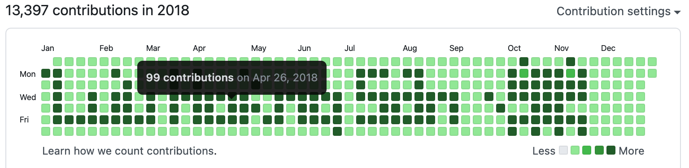

# Luu Hoang Son

- This repository's purpose is creating a pixel art based-on git contributions
- You must specify which dates you wanna color it and how many commits created. You can take a look at square.txt for example



```shell script
$python3  main.py --fp square.txt 
```
**NOTES**
- Remember setup your git project first!